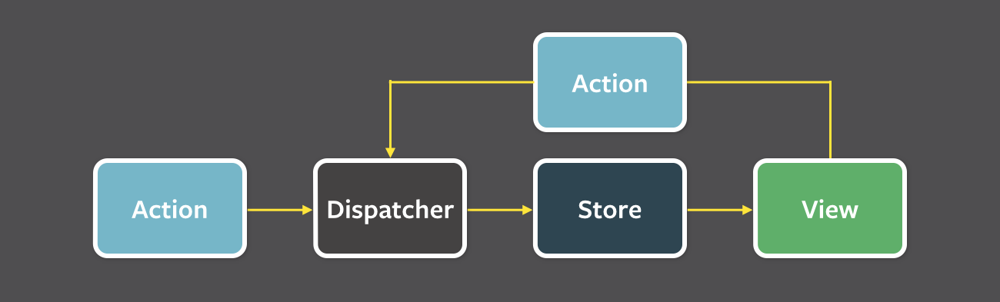

#  RSSReader - приложение для чтения RSS

Приложение реализовано с использованием архитектуры Flux 

(c помощью библиотеки ReSwif, подробно о Flux - например, <a href=https://medium.com/@rjchatfield/flux-in-swift-7c8f416d6dbe>тут</a>)

Помимо этого используемые библиотеки: 
- PromiseKit (упрощает работу с асинхронщиной)
- FeedKit (парсит всякое RSS и т.п.)

## Как работает:
3 экрана:
- Экран логина - Тут пользователь логинится или наоборот, логаутится, есть переход на экран регистрации для регистрации нового пользователя
- Экран RSS новостей - лента из RSS новостей, грузит RSS Apple news (захардкорено в коде, легко добавить любой другой источник RSS), сравнивает с сохраненными новостями в CoreData - записывает новые. Если попытка загрузки неудачна (проблемы с интернетом) - пытается загрузить сохраненные новости в CoreData.
Любую новость пользователь может пометить как bookmark - нажав на соответствующую кнопку на новости (или, если новость уже отмечена, отменить). Все изменения сохраняются в базе данных.
- Экран закладок - здесь отображаются только отмеченные для текущего пользователя новости.

Состояние программы (например, текущий залогиненный пользователь) сохраняется (в UserDefaults).

## Задание

#### Реализовать простое приложение реализующие функцию просмотра новостей с пользовательским предпочтениями.

Приложение визуально должно иметь:
	- главный список новостей (+ дочерний экран деталей новости)
	- экран аккаунта
	- переключение между ними по вкладкам внизу экрана

### Список новостей:
1. Использовать любой RSS источник данных, например http://habrahabr.ru/rss/hubs/ , для отображения в списке данных.
2. Разобрать и сохранить данные списка новостей в локальное хранилище (после перезапуска приложения в списке новостей должен отображаться последний сохраненный успешно вариант при отсутствии подключения к Интернет).
3. Отобразить данные ленты в виде списка, в котором в каждой строке должны отображаться заголовок, дата записи, не более 5 строк начала текста новости. Данные должны быть упорядочены по дате в порядке убывания.
4. Реализовать автоподстройку размера ячейки под размер контента но показывать не более 5 строк новости.
5. Обновление данных по Pull to Refresh сверху таблицы.
6. При тапе на конкретную запись открыть полную запись по полученной ссылке на отдельном экране деталей во внедренном в экран браузере
7. По долгому тапу на новости в списке либо нажатию action-кнопки на экране деталей, открывать action sheet с вариантами: сохранить в избранное/либо убрать если оно уже там. Должно работать, если пользователь авторизован.

### Аккаунт:
1. На экране аккаунта, в случае отсутствия авторизации должно предлагаться авторизоваться (по простому - захардкодить логин/пароль).
2. В случае если пользователь уже авторизован на экране должно быть: кнопка выхода, кнопка избранного, в котором отображаются избранные новости в том же виде что и на главной странице.

### Технические требования:
- Приложение должно поддерживать iOS 9 и выше
- Проект должен быть написан с использованием ARC
- Проект должен быть написан на Swift и Objective C одновременно (преимущественно Swift).
- Хранение данных должно быть организовано с использованием Core Data.
- Обновление данных (включая запись) должно производиться не в основном потоке.
- Верстка экранов должна быть реализована с использованием storyboard, size classes, autolayout.
